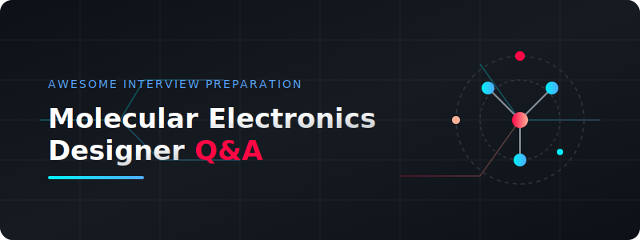

  

# 🧪 Awesome Molecular Electronics Designer Interview Q&A 💡

Welcome to the ultimate preparation hub for **Molecular Electronics Designer** interviews! This repository contains curated questions, answers, and study resources covering nanofabrication, quantum transport, self-assembly, and characterization.

---

## 🗺️ Navigation & Questions

Explore the core interview topics below:

| Topic | Description | Link |
| :--- | :--- | :--- |
| **🧪 Molecular Electronics** | Key concepts in molecular junction design & behavior | [View Question 01](file:///C:/Users/ishan/Documents/Projects/Awesome-Molecular-Electronics-Designer-Interview/questions/01-molecular-electronics.md) |
| **🏗️ Nanofabrication** | Advanced lithography and fabrication workflows | [View Question 02](file:///C:/Users/ishan/Documents/Projects/Awesome-Molecular-Electronics-Designer-Interview/questions/02-nanofabrication.md) |
| **⚡ Charge Transport** | Coherent tunneling, hopping, and quantum transport | [View Question 03](file:///C:/Users/ishan/Documents/Projects/Awesome-Molecular-Electronics-Designer-Interview/questions/03-transport.md) |
| **🧩 Self-Assembly** | Bottom-up synthesis and molecular self-assembly monolayers | [View Question 04](file:///C:/Users/ishan/Documents/Projects/Awesome-Molecular-Electronics-Designer-Interview/questions/04-self-assembly.md) |
| **🔍 Characterization** | STM, AFM, and spectroscopy techniques for single molecules | [View Question 05](file:///C:/Users/ishan/Documents/Projects/Awesome-Molecular-Electronics-Designer-Interview/questions/05-characterization.md) |

---

## 🛠️ How to Contribute

Contributions are welcome! Please refer to our [CONTRIBUTING.md](file:///C:/Users/ishan/Documents/Projects/Awesome-Molecular-Electronics-Designer-Interview/CONTRIBUTING.md) guide for details on how to add new questions, improve existing sample answers, or submit pull requests.

## 📄 License

This project is licensed under the [LICENSE](file:///C:/Users/ishan/Documents/Projects/Awesome-Molecular-Electronics-Designer-Interview/LICENSE) - see the file for details.
